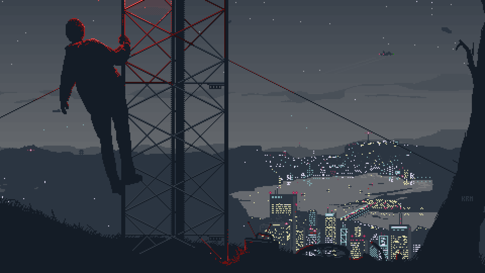

  
  <h1>Hey there 👋, I'm Canvexter</h1>
  <h3>Programmer • Designer • Artist • Tech Enthusiast</h3>

  

 

<h2 align="center">🎨 About Me</h2>

  
👨‍💻 I’m a <strong>multi-disciplinary creator</strong> — code, design, and art are my playgrounds.

  
🖌️ I love turning <strong>ideas into visually captivating interfaces</strong>.

  
⚙️ Constantly experimenting with <strong>new tools and technologies</strong>.

  
🚀 Passionate about merging <strong>artistic expression with innovative tech</strong>.

 

<h2 align="center">⚙️ Tools, Languages & Frameworks</h2>

  
  
  

 

<h2 align="center">📊 My GitHub Stats</h2>

  
    
  
  

 

<h2 align="center">🔗 Connect With Me</h2>

    
    
    
    
    
    
    

  

<h2 align="center">☕ Support Me</h2>

